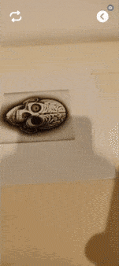

# 270 Seconds - The Irreversible Loss

This project was requested by a student for their final presentation in an art bachelor course. 
The application explores the theme of brain death, and based on their conceptual idea, we developed an augmented reality experience in Unity.

The project centers around the brain's response to oxygen deprivation. 

That deprivation triggers a brief but intense 30-second phase of hyperstimulation, followed by a sudden deceleration that inflicts gradual damage until reaching a critical point at the 4:30 minute mark, or 270 seconds, when irreversible damage sets in.

# How it works

## Intro
The application begins with an animation of a melting head, transitioning to the title of the project.

The menu has a glitchy animation and is composed by a human cell which can be dragged to the available options. 

## Videos
In this section it's possible to watch the videos made for the project. Due to the large file size of the original videos, we replaced them with placeholders for this upload. 

## AR
The original art presentation used a book, where two of its pages served as the target images for the AR models. For the purposes of this upload, we use two AI generated images instead of the original book pages.

When pointing the camera at these images, a head emerges and starts to melt, revealing the :brain:.

The app reacts differently to two distinct images: one plays the animation normally, while the other plays a reversed version.

As a way to represent the aforementioned 30 seconds of hyperstimulation, a glitch effect is triggered on the 3D models after the app has been in use for over 30 seconds.

  

If you want to try, you can find the images here:

- [Normal animation](https://github.com/ShenanigansInc/270-seconds/blob/main/Assets/AR%20Project/Images/target_play.png)

- [Reversed animation](https://github.com/ShenanigansInc/270-seconds/blob/main/Assets/AR%20Project/Images/target_reverse.png)

## Ending
After 270 seconds of continuously using the application, an error animation is shown stating that there is irreversible damage, and the application shuts down.

# Content
While the main assets were created by the artist who requested the application, we use the following free-use content:

[dark ambient cello_80](https://freesound.org/people/LogicMoon/sounds/661930/) by [LogicMoon](https://freesound.org/people/LogicMoon/)

[Dramatic Scene Separation Melancholy](https://freesound.org/people/Vasyl_Sakal/sounds/711276/) by [Vasyl_Sakal](https://freesound.org/people/Vasyl_Sakal/)

[Dark Ambient Atmosphère 2](https://pixabay.com/music/ambient-dark-ambient-atmosphere-2-141314/) by [danydory](https://pixabay.com/users/danydory-9903/)

[Bad TV Reception](https://www.videezy.com/elements-and-effects/244-bad-tv-reception-stock-video-clip) Stock Footage by <a href="http://www.videezy.com">Videezy</a> 

[Melting Transition](https://www.videezy.com/abstract/45190-melting-matte-transition-effects-on-a-dark-background) Stock Footage by <a href="http://www.videezy.com">Videezy</a> 

[Jellyfish Moving Underwater](https://www.videezy.com/nature/45427-jellyfish-moving-underwater) Stock Footage by <a href="http://www.videezy.com">Videezy</a>

AI images generated by [perchance](https://perchance.org/ai-character-generator)

# Vuforia
If you want to download the project, you'll have to install and configure the Vuforia plugin yourself. Check out the [official website](https://developer.vuforia.com/) for more info.
